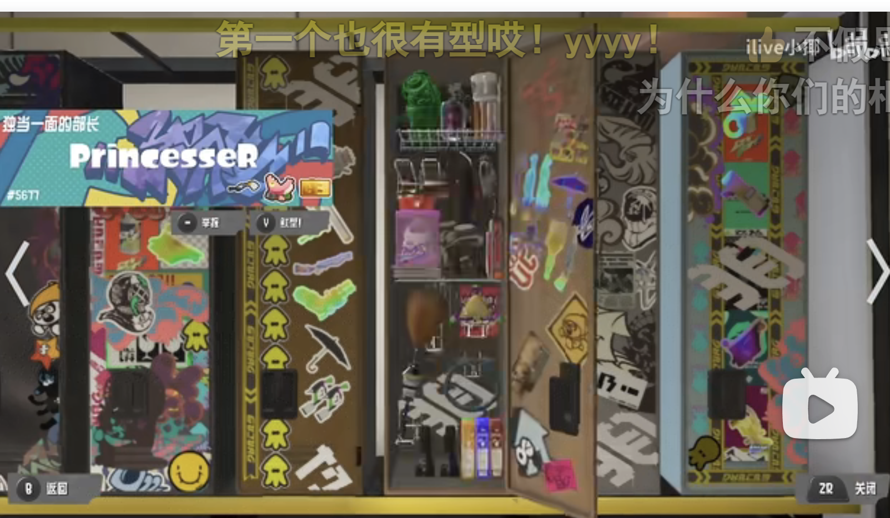

# Auto_EEA

### 当前项目

1. 制衡林凉凉
2. 学科竞赛集训基地

# 制衡林凉凉

## 一.工位管理

原来的流程是lll告诉ld然后ld和lll一起制裁全体电协，管理层擦屁股

**工位管理：** 工位贴所属人**名字**，工位所属区域归**个人负责**。林凉凉视察时让他直接记名字。

公共区域物品定时清理，不知所属直接丢了。如果是贵重物品集中放在百宝箱包金币。

**定期清扫：** 周期清理移交志愿者，专用置物区域以外，落地一律清理。工位单独立垃圾桶。

​	**志愿者：** 走青协按周规划志愿者清理。分配内部报名或者外部报名。**晋江科教园本科生创新创业中心爱净行动**

​	**成果展示：** 清理完后拍照每次打扫完群里发图片，**交给林凉凉**。

**物品管理：** **封闭式置物柜**（如日本储物柜，空间以及高度适中），按人分柜子。开放式柜子用来摆作品以及奖杯。公共财产统一放公共分类区域。

**关门问题：** 换能自动关的门。（待定）

**关灯问题：** 使用科技手段监控上yolo实现自动开关灯。（待定）

## 二.对接

**宣称：** 有领导支持建设竞赛基地，电协内部改革卫生制度，更换对接人，电协将展示全新的样貌。

**问责应对：** 工位已经划分到人，问责就在群内@说明后，按人汇报给林凉凉，当神圣分离者。

**林凉凉来找茬：** 以某种方法提示他看一下是谁的座位脏乱，让他找茬落实到人，转移矛盾。对接人身份变成传话员。

**空调问题：** 以某种理由争取到24小时空调开机，如器材须保持干燥，服务器运行温度需要等。

# 学科竞赛集训基地

## 一.**基地主要建设内容**

包括现有基地场所，教学与竞赛设备，竞赛平台，建设目标等

#### 基地场所

**现有基地场所：** 科技园A307、A308
**目前教学与竞赛设备：** 协会工位、嵌入式开发板、传感器、示波器、pcb制作产线**竞赛平台：** 竞赛平台目前建设较为不完善,目前可以使用校内公共资源。
**建设目标：**现基地场所管理制度不完善，卫生条件一般。为响应校领导号召，调整基地内部管理制度，落实工位分发，加强卫生管理，采用封闭式储物柜。推动对外合作。

1. 增加新型的嵌入式开发板和传感器，以适应不同比赛的需求。
2. 优化工作环境，例如增加可调节的工作台、合适的照明、和舒适的座椅、增设垃圾桶。
3. 完善竞赛平台，包括提供在线编程和调试工具，方便学生进行远程操作和模拟。
4. 和自动门、灯等设施。